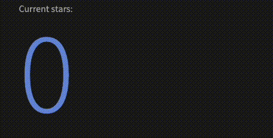

# CountUp.js

CountUp.js is a dependency-free, lightweight Javascript class that animates a numerical value by counting to it.

Despite its name, CountUp can count in either direction, depending on the start and end values that you provide.

CountUp.js supports all browsers. MIT license.

## [Try the demo](https://inorganik.github.io/countUp.js)

Or tinker with CountUp in [Stackblitz](https://stackblitz.com/edit/countup-typescript)

## Jump to:

- **[Usage](#usage)**
- **[Including CountUp](#including-countup)**
- **[Contributing](#contributing)**
- **[Creating Animation Plugins](#creating-animation-plugins)**

## Features

- **Auto-animate when element becomes visible.** Use option `autoAnimate = true`.
- **Highly customizable** with a large range of options, you can even substitute numerals.
- **Smart easing**: CountUp intelligently defers easing to make it visually noticeable. Configurable in the [options](#options).
- **Plugins** allow for alternate animations like the [Odometer plugin](https://www.npmjs.com/package/odometer_countup)



## Usage:

**Use CountUp with:**

- [Angular 2+](https://github.com/inorganik/ngx-countUp)
- [React](https://gist.github.com/inorganik/2cf776865a4c65c12857027870e9898e)
- [Svelte](https://gist.github.com/inorganik/85a66941ab88cc10c5fa5b26aead5f2a)
- [Vue](https://github.com/xlsdg/vue-countup-v2)
- [WordPress](https://wordpress.org/plugins/countup-js/)
- [jQuery](https://gist.github.com/inorganik/b63dbe5b3810ff2c0175aee4670a4732)
- [custom element](https://github.com/lekoala/formidable-elements/blob/master/docs/count-up.md)

**Use CountUp directly:**

On npm as `countup.js`. You can import as a module, or include the UMD script and access CountUp as a global. See [detailed instructions](#including-countup) on including CountUp.

**Params**:

- `target: string | HTMLElement | HTMLInputElement` - id of html element, input, svg text element, or DOM element reference where counting occurs.
- `endVal: number | null` - the value you want to arrive at. Leave null to use the number in the target element.
- `options?: CountUpOptions` - optional configuration object for fine-grain control

**Options**: 


| Option                 | Type            | Default       | Description                                             |
| ---------------------- | --------------- | ------------- | ------------------------------------------------------- |
| `startVal`             | `number`        | `0`           | Number to start at                                      |
| `decimalPlaces`        | `number`        | `0`           | Number of decimal places                                |
| `duration`             | `number`        | `2`           | Animation duration in seconds                           |
| `useGrouping`          | `boolean`       | `true`        | Example: 1,000 vs 1000                                  |
| `useIndianSeparators`  | `boolean`       | `false`       | Example: 1,00,000 vs 100,000                            |
| `useEasing`            | `boolean`       | `true`        | Ease animation                                          |
| `smartEasingThreshold` | `number`        | `999`         | Smooth easing for large numbers above this if useEasing |
| `smartEasingAmount`    | `number`        | `333`         | Amount to be eased for numbers above threshold          |
| `separator`            | `string`        | `','`         | Grouping separator                                      |
| `decimal`              | `string`        | `'.'`         | Decimal character                                       |
| `easingFn`             | `function`      | `easeOutExpo` | Easing function for animation                           |
| `formattingFn`         | `function`      | —             | Custom function to format the result                    |
| `prefix`               | `string`        | `''`          | Text prepended to result                                |
| `suffix`               | `string`        | `''`          | Text appended to result                                 |
| `numerals`             | `string[]`      | —             | Numeral glyph substitution                              |
| `onCompleteCallback`   | `function`      | —             | Callback called when animation completes                |
| `onStartCallback`      | `function`      | —             | Callback called when animation starts                   |
| `plugin`               | `CountUpPlugin` | —             | Plugin for alternate animations                         |
| `autoAnimate`          | `boolean`       | `false`       | Trigger animation when target becomes visible           |
| `autoAnimateDelay`     | `number`        | `200`         | Animation delay in ms after auto-animate triggers       |
| `autoAnimateOnce`      | `boolean`       | `false`       | Run animation only once for auto-animate triggers       |
| `enableScrollSpy`      | `boolean`       | —             | *(deprecated)* Use `autoAnimate` instead                |
| `scrollSpyDelay`       | `number`        | —             | *(deprecated)* Use `autoAnimateDelay` instead           |
| `scrollSpyOnce`        | `boolean`       | —             | *(deprecated)* Use `autoAnimateOnce` instead            |


**Example usage**: 

```js
const countUp = new CountUp('targetId', 5234);
if (!countUp.error) {
  countUp.start();
} else {
  console.error(countUp.error);
}
```

Pass options:

```js
const countUp = new CountUp('targetId', 5234, options);
```

with optional complete callback:

```js
const countUp = new CountUp('targetId', 5234, { onCompleteCallback: someMethod });

// or (passing fn to start will override options.onCompleteCallback)
countUp.start(someMethod);

// or
countUp.start(() => console.log('Complete!'));
```

**Other methods**:

Toggle pause/resume:

```js
countUp.pauseResume();
```

Reset the animation:

```js
countUp.reset();
```

Update the end value and animate:

```js
countUp.update(989);
```

Destroy the instance (cancels animation, disconnects observers, clears callbacks):

```js
countUp.onDestroy();
```
---

### **Auto animate when element becomes visible**

Use the `autoAnimate` option to animate when the element is scrolled into view or appears on screen. When using autoAnimate, just initialize CountUp but do not call start(). 

```js
const countUp = new CountUp('targetId', 989, { autoAnimate: true });
```

**Note** - Auto-animate uses IntersectionObserver which is broadly supported, but if you need to support some very old browsers, v2.9.0 and earlier use a window on-scroll handler when `enableScrollSpy` is set to true.

---

### **Alternate animations with plugins**

Currently there's just one plugin, the **[Odometer Plugin](https://github.com/msoler75/odometer_countup.js)**.

To use a plugin, you'll need to first install the plugin package. Then you can include it and use the plugin option. See each plugin's docs for more detailed info.

```js
const countUp = new CountUp('targetId', 5234, {
  plugin: new Odometer({ duration: 2.3, lastDigitDelay: 0 }),
  duration: 3.0
});
```

If you'd like to make your own plugin, see [the docs](#creating-animation-plugins) below!

### Tabular nums

To optimize the styling of counting number animations, you can take advantage of an OpenType feature called tabular nums which stabilizes jitteryness by using equal-width numbers.

In my experience, most OpenType fonts already use tabular nums, so this isn't needed. But it may help to add this style if they don't:

```css
font-variant-numeric: tabular-nums;
```

---

## Including CountUp

CountUp is distributed as an ES module, though a UMD module is [also included](#umd-module), along with a separate requestAnimationFrame polyfill (see below).

For the examples below, first install CountUp:

```
npm i countup.js
```

### Example with vanilla js

This is what is used in the demo. Checkout index.html and demo.js.

main.js:
```js
import { CountUp } from './js/countUp.min.js';

window.onload = function() {
  var countUp = new CountUp('target', 2000);
  countUp.start();
}
```

Include in your html. Notice the `type` attribute:

```html
<script src="./main.js" type="module"></script>
```

If you prefer not to use modules, use the `nomodule` script tag to include separate scripts:

```html
<script nomodule src="js/countUp.umd.js"></script>
<script nomodule src="js/main-for-legacy.js"></script>
```

To run module-enabled scripts locally, you'll need a simple local server setup like [this](https://www.npmjs.com/package/http-server) (test the demo locally by running `npm run serve`) because otherwise you may see a CORS error when your browser tries to load the script as a module.

### For Webpack and other build systems

Import from the package, instead of the file location:

```js
import { CountUp } from 'countup.js';
```

### UMD module

CountUp is also wrapped as a UMD module in `./dist/countUp.umd.js` and it exposes CountUp as a global variable on the window scope. To use it, include `countUp.umd.js` in a script tag, and invoke it like so:

```js
var numAnim = new countUp.CountUp('myTarget', 2000);
numAnim.start()
```

---

## Contributing

Before you make a pull request, please be sure to follow these instructions:

1. Do your work on `src/countUp.ts`
1. Lint: `npm run lint`
1. Run tests: `npm t`
1. Build and serve the demo by running `npm start` then check the demo to make sure it counts.

<!-- PUBLISHING

1. bump version in package.json and countUp.ts
2. npm run build
3. commit changes
4. npm publish

-->

---

## Creating Animation Plugins

CountUp supports plugins as of v2.6.0. Plugins implement their own render method to display each frame's formatted value. A class instance or object can be passed to the `plugin` property of CountUpOptions, and the plugin's render method will be called instead of CountUp's.

```ts
export declare interface CountUpPlugin {
  render(elem: HTMLElement, formatted: string): void;
}
```

An example of a plugin:

```ts
export class SomePlugin implements CountUpPlugin {
  // ...some properties here

  constructor(options: SomePluginOptions) {
    // ...setup code here if you need it
  }

  render(elem: HTMLElement, formatted: string): void {
    // render DOM here
  }
}
```

If you make a plugin, be sure to create a PR to add it to this README!
